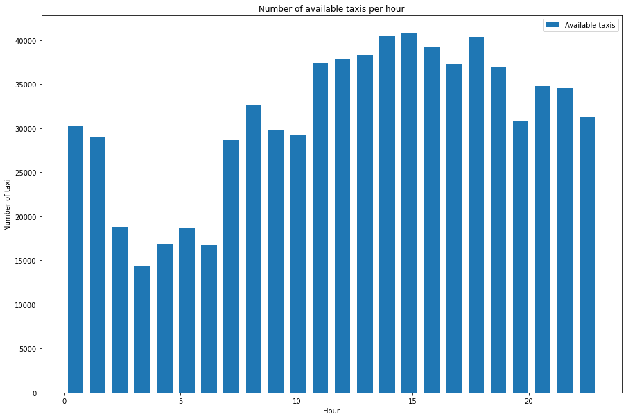
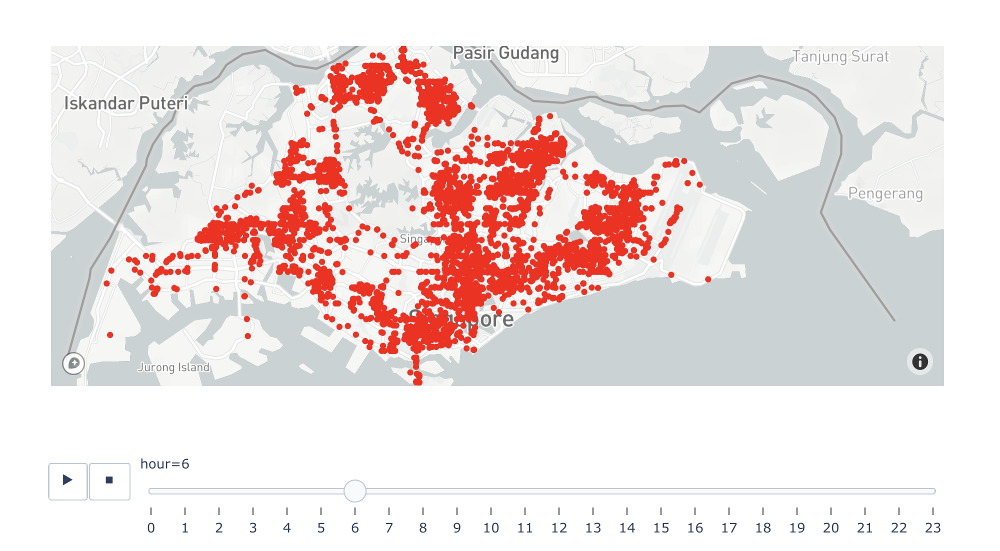
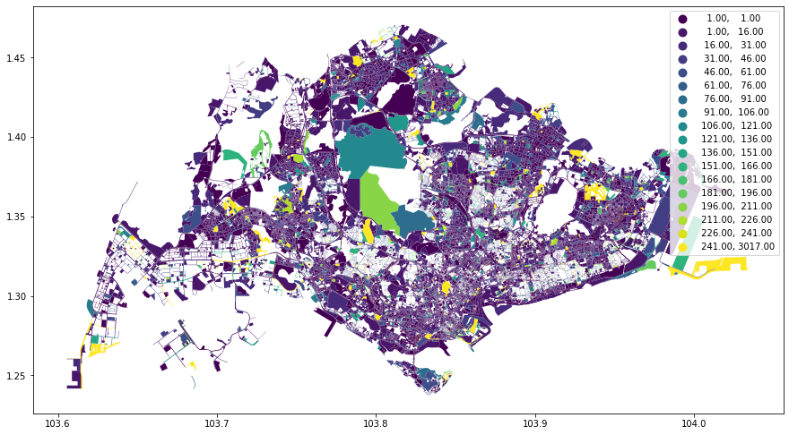
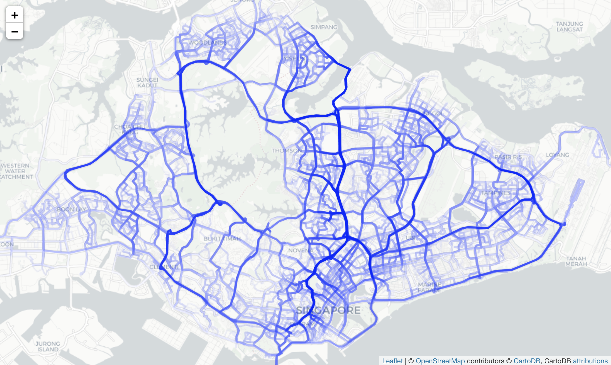

# Taxi Availability EDA

An exploratory data analysis on taxi availability in Singapore

Dataset: Extracted from the API endpoint (https://api.data.gov.sg/v1/transport/taxi-availability) The below function was used to collect the data and store in a CSV file `taxi_availability.csv`.

```python
import csv
import datetime

import requests

# https://data.gov.sg/dataset/taxi-availability
API_URL = "https://api.data.gov.sg/v1/transport/taxi-availability"


def collect_data():
    # The data we receive is on the nearest datetime from the requested datetime. If we
    # start from minute 0, we might get the data from the previous day resulting in the
    # data started from hour 23 to hour 23 the next day. This could be problematic when
    # either sorting/showing the data.
    #
    # The workaround would be to start roughly a minute later for the day we would like
    # to collect the data from.
    start = datetime.datetime(year=2021, month=8, day=1, hour=0, minute=1, second=0)
    end = datetime.datetime(year=2021, month=8, day=1, hour=23, minute=59, second=59)
    delta = datetime.timedelta(minutes=10)

    with open("taxi_availability_every_10_minutes.csv", "w") as csvfile:
        fieldnames = ["timestamp", "coordinate", "longitude", "latitude"]
        writer = csv.DictWriter(csvfile, fieldnames=fieldnames)
        writer.writeheader()
        while start < end:
            print(f"Collecting data on {start}...")
            response = requests.get(API_URL, params={"date_time": start.isoformat()})
            data = response.json()
            features = data["features"][0]
            timestamp = features["properties"]["timestamp"]
            for coordinate in features["geometry"]["coordinates"]:
                writer.writerow(
                    {
                        "timestamp": timestamp,
                        "coordinate": coordinate,
                        "longitude": coordinate[0],
                        "latitude": coordinate[1],
                    }
                )
            start += delta
```

## Number of available taxis per hour



- The number of taxis available are less in the morning and increases in the afternoon and then decreases back again during the midnight.
- As the number of people commuting increases, the supply for the taxis increases with it.


## Time series map of available taxis by the hour



The above is video showing the available taxis by the hour.

## Number of available taxis by the region



## Number of available taxis per hour by the region

TODO: images

## Routes taken by the available taxis on an average day


